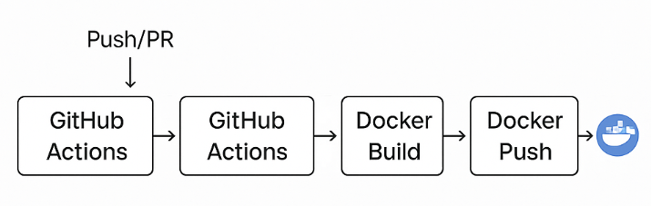

# 2025cloud

## Introduction
The purpose of this project is to show how to use GitHub Action to create and automatically deploy Docker images.

## 🔧 Build and Execute

### Build Container Image

```bash
docker build -t 2025cloud .
```
### Run Container Image

```bash
docker run -p 5000:5000 2025cloud
```

## 🚀 My Design


GitHub Actions are triggered on push and pull request. It automates:

Docker Build

Docker Tagging

Docker Push

Secrets Used
To avoid exposing credentials, Docker Hub credentials are stored in GitHub repository secrets:
```
        username: ${{ secrets.DOCKER_USERNAME }}
        password: ${{ secrets.DOCKER_PASSWORD }}
```
